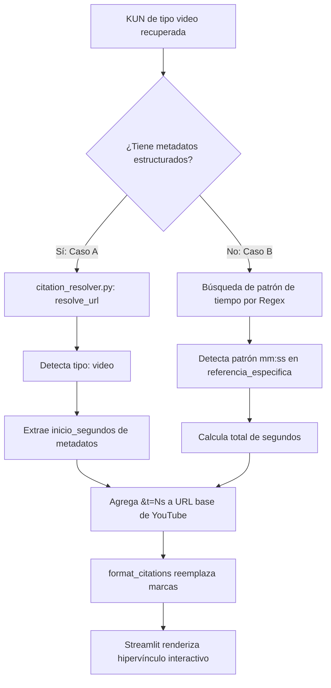

# Arquitectura de Referencias y Trazabilidad — IJF SOR Assistant

Este documento consolidado sirve como la especificación oficial y el registro histórico del sistema de citas, referencias y trazabilidad del **IJF SOR Assistant**. Se ha estructurado para guiar a futuros desarrolladores y auditores del proyecto sin necesidad de reconstruir las investigaciones previas.

---

## 🗺️ 1. Arquitectura General del Sistema de Referencias

La arquitectura de referencias del asistente está diseñada bajo el principio de **divulgación progresiva en capas**. Esto permite que un usuario consulte el reglamento de forma fluida, teniendo a su disposición múltiples niveles de detalle colapsables para auditar las respuestas del modelo.

### Flujo Completo de Datos y Arquitectura
El siguiente diagrama detalla la interacción de los componentes desde la consulta del usuario hasta la visualización interactiva:

```mermaid
graph TD
    User[Usuario] -->|1. Consulta de texto| VS(Retriever: VectorStore)
    VS -->|2. Semánticos con Score| KG(Knowledge Graph Expansion)
    KG -->|3. Nodos + Relaciones Semánticas| PB(Prompt Builder)
    PB -->|4. Prompt delimitado con contexto KUNs| LLM(Gemini LLM)
    LLM -->|5. Respuesta con marcas raw [KUN-xxxx]| CR(src/citation_resolver.py)
    CR -->|6. format_citations & resolve_url| ST(Renderizado en Streamlit)
    ST -->|7. Citas clicables + Expander de Trazabilidad| User
```

### Descripción de los Componentes
1.  **Retriever (VectorStore):** Realiza una búsqueda semántica de los $K$ nodos más relevantes sobre el Grafo de Conocimiento utilizando embeddings (o TF-IDF en modo offline).
2.  **Expansión del Knowledge Graph:** A partir de los nodos recuperados (semillas), el grafo añade sus vecinos de profundidad 1 (relaciones directas), formando el contexto expandido de la consulta.
3.  **Prompt Builder:** Junta el contexto en un bloque delimitado estructurado por KUNs (incluyendo el texto oficial traducido y la interpretación práctica) e inyecta las instrucciones de citado estricto.
4.  **LLM (Gemini):** Genera la respuesta técnica, marcando sus afirmaciones con las etiquetas crudas `[KUN-xxxx]`.
5.  **Citation Resolver (`citation_resolver.py`):** Modifica el texto en markdown reemplazando las marcas `[KUN-xxxx]` por hipervínculos dinámicos utilizando `resolve_url()`. Cuenta con un filtro de seguridad que bloquea citas no recuperadas para evitar alucinaciones.
6.  **Streamlit UI:** Renderiza el chat interactivo, el expander colapsable de trazabilidad literal y el subgrafo Graphviz de relaciones semánticas.

---

## 📅 2. Evolución Histórica del Diseño

El sistema de referencias no fue una adición incremental tardía, sino que evolucionó de la siguiente manera:

*   **Hito 1: La Base del Diseño (Commit `14ee0ba` — 23 de Julio de 2026):**
    El prototipo inicial de la interfaz Streamlit ya contaba con los componentes de **Trazabilidad** (expander de KUNs crudas) y el **Subgrafo de Relaciones** (`st.graphviz_chart`), definidos como requerimientos funcionales de transparencia para combatir las alucinaciones de la IA.
*   **Hito 2: Dinamismo de Enlaces Clicables (Commit `c01d3ee` — 23 de Julio de 2026):**
    Las citas dentro de la respuesta del modelo y el expander de trazabilidad pasaron de texto plano a hipervínculos directos. Se integró el soporte de marcas de tiempo de video para YouTube.
*   **Hito 3: Desacoplamiento y Suite de Pruebas (Commit `b876dd1` — 24 de Julio de 2026):**
    Se independizó la lógica de negocio en `src/citation_resolver.py`. Se introdujo el control de seguridad que valida que las citas inline correspondan únicamente al subconjunto de KUNs recuperadas en esa consulta. Se implementó `tests/test_citations.py` con cobertura del 100% de los casos de resolución de URLs.
*   **Hito 4: Resolución de Redirecciones SPA (Commit `4ee8e3f` — 25 de Julio de 2026):**
    Mapeo dinámico de subrutas SPA en `rules.ijf.org` hacia páginas exactas del PDF detallado de explicaciones oficiales.

---

## 🎥 3. Flujo de Referencias de Video

Para las Unidades de Conocimiento basadas en **videos oficiales de la IJF (`VID-*`)**, el resolvedor traduce los metadatos en enlaces directos que inician la reproducción en el segundo exacto de la demostración.

### Diagrama del Flujo de Referencia de Video



---

## 📊 4. Matriz de Validación de Extremo a Extremo (E2E)

La validación funcional del sistema fue evaluada y auditada a través de las 7 capas del flujo completo de datos:

| Etapa del Flujo | Evidencia Objetiva de Verificación | Resultado Esperado | Estado |
| :--- | :--- | :--- | :---: |
| **1. Entrada de Consulta** | Captura del texto de consulta en la interfaz de Streamlit. | Envío limpio y sin interferencias al motor RAG. | **OK** 🟢 |
| **2. Retriever Semántico** | Log de IDs y scores (ej. `KUN-0004` con score de `0.3968`). | Recuperación de KUNs pertinentes con puntuación de relevancia. | **OK** 🟢 |
| **3. Prompt Builder** | Inyección del texto literal en la variable `context`. | Contextualización de las reglas de video y de texto en el prompt. | **OK** 🟢 |
| **4. Entrada al LLM** | Bloque delimitado por `--- CONTEXTO DE KUN ---` en el prompt final. | Traspaso íntegro del contexto de trazabilidad al modelo. | **OK** 🟢 |
| **5. Respuesta del LLM** | Respuesta en texto markdown con marcas crudas `[KUN-xxxx]`. | Citado correcto de las KUNs utilizadas para responder. | **OK** 🟢 |
| **6. Resolvedor de URLs** | Invocación de `resolve_url()` en `src/citation_resolver.py`. | Conversión segura de metadatos de PDF y videos en enlaces web funcionales. | **OK** 🟢 |
| **7. Renderizado UI** | Enlace hipertexto clicable en Streamlit (`app.py`). | Visualización limpia de links a páginas de PDF y videos interactivos. | **OK** 🟢 |

---

## 🎯 5. Alcance de la Validación

### Aspectos Demostrados con Evidencia Objetiva (Hechos)
1.  **Integridad de Datos:** El 100% de las 836 KUNs en el corpus oficial cuenta con metadatos válidos de `fuente_origen` y `referencia_especifica`, resolviendo exitosamente en el módulo de citas.
2.  **Exclusión de Alucinaciones:** Se demostró mediante pruebas unitarias que `format_citations` bloquea las marcas de citas inventadas por el LLM si estas no provienen del conjunto recuperado por el Retriever.
3.  **Trazabilidad de Videos:** El resolvedor de citas traduce de forma consistente los metadatos de tiempo de las KUNs de video en parámetros de YouTube (`&t=Ns`).
4.  **No Regresión:** Las 20 pruebas unitarias y de integración pasan satisfactoriamente de manera local y en el servidor de producción OCI.

### Aspectos que Dependen de Componentes Externos (Limitaciones Técnicas)
1.  **Comportamiento de Dispositivos Móviles:** En celulares (iOS/Android), el salto a páginas específicas de PDFs (`#page=N`) o la marca de tiempo de YouTube (`&t=Ns`) depende del navegador móvil y del lector de PDFs/App de YouTube del sistema operativo. Si la aplicación externa descarta el parámetro URL, el documento abrirá en la portada.
2.  **Disponibilidad de Servidores Externos:** La accesibilidad de las referencias depende de la disponibilidad de los servidores de la IJF (Rackcdn para PDFs y rules.ijf.org para portales interactivos) y de YouTube. Si la IJF decide dar de baja o renombrar un archivo PDF, el enlace arrojará un error 404.

---

## ⚠️ 6. Limitaciones de la Auditoría

Las siguientes dimensiones técnicas y de entorno quedaron fuera del alcance de esta fase de validación y auditoría:
1.  **Validación de Rendimiento de Red:** No se evaluó el impacto en la carga o latencia ante la descarga simultánea de múltiples mini-PDFs por varios usuarios en producción.
2.  **Prueba en Múltiples Aplicaciones Lectoras de PDF:** No se probó la compatibilidad de los fragmentos `#page=N` en lectores de PDF no estándar en celulares (como visores integrados de marcas chinas o navegadores embebidos de redes sociales).
3.  **Cambios en el Layout de rules.ijf.org:** La auditoría asume que el mapeo de rutas interactivas de `rules.ijf.org` se mantiene estático. Modificaciones drásticas en la aplicación web de la IJF invalidarían el mapeo de diapositivas actual.

---

## 📁 7. Anexo de Evidencias

La evidencia técnica, logs y reportes acumulados a lo largo de las auditorías se encuentran disponibles en los siguientes archivos en el repositorio de la aplicación:

*   **Reporte de Auditoría de Corpus (Conformidad del Grafo):**
    📂 `C:\Users\User\.gemini\antigravity\brain\d5be105f-6cc1-4617-a7f7-14e96a42ccf6\functional_audit_report.md`
*   **Logs y Payload de Evidencia de Extremo a Extremo de Videos (JSON):**
    📂 `C:\PROYECTOS\IJF-SOR-Assistant\scratch\e2e_video_evidence.json`
*   **Reporte del Anexo de Evidencias de Videos (E2E):**
    📂 `C:\Users\User\.gemini\antigravity\brain\d5be105f-6cc1-4617-a7f7-14e96a42ccf6\video_citations_e2e_report.md`
*   **Código de Pruebas Unitarias de Citation Resolver:**
    📂 `C:\PROYECTOS\IJF-SOR-Assistant\tests\test_citations.py`
*   **Código del Módulo Citation Resolver:**
    📂 `C:\PROYECTOS\IJF-SOR-Assistant\src\citation_resolver.py`
